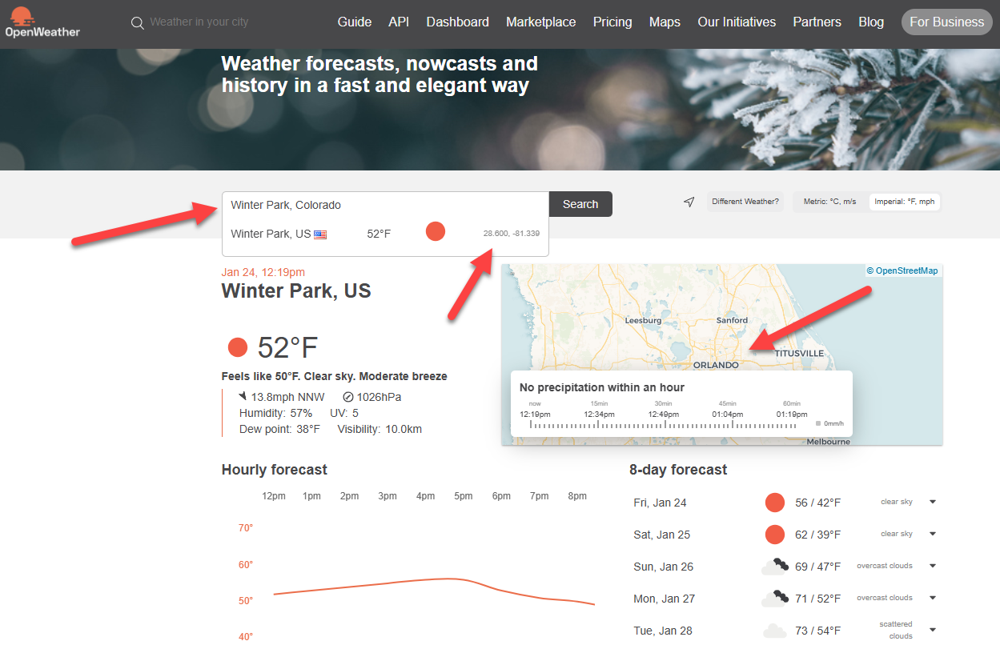
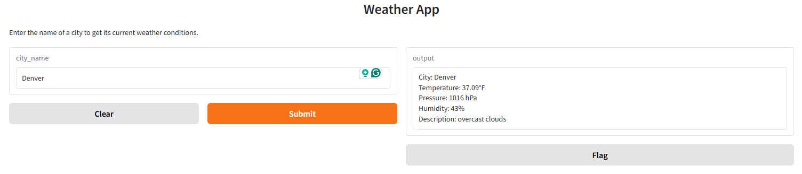

# 30min_challenge

# Weather App

## Description

Recently, I was challenged with a 30 minute coding exercise to see what I could create in 30 minutes.
This is the result of this effort.

This Weather App provides users with current weather information for a city of their choice. It fetches the weather data from the [OpenWeatherMap API](https://openweathermap.org/api) and displays details such as temperature, pressure, humidity, and a brief description of the weather. The app is built using Python, Gradio for the user interface, and requests to interact with the OpenWeatherMap API.

## Requirements

To run this app, you'll need to have the following installed:

- Python 3.x
- `requests` library
- `gradio` library
- `.env` file containing your API key from OpenWeatherMap.

### Install Dependencies

Use the following command to install the required Python libraries:

```bash
pip install requests gradio python-dotenv
```

### API Key

This app requires an API key from OpenWeatherMap. If you don't have one, you can sign up [here](https://openweathermap.org/api) to get your API key.

After obtaining the key, create a `.env` file in the same directory as this script and add the following line to it:

```
API_KEY=your_api_key_here
```

## How to Run

1. Clone or download this repository to your local machine.
2. Install the required dependencies by running `pip install -r requirements.txt`.
3. Run the script using the following command:

```bash
python Weather.py
```

The app will start a Gradio interface where you can input the name of a city to get the weather details.

## How It Works

- When the app starts, it loads the environment variables from the `.env` file to fetch the API key.
- The user enters a city name, and the app calls the OpenWeatherMap API to retrieve weather data.
- The app will then display the weather details, such as:
  - Temperature (in Fahrenheit)
  - Pressure (in hPa)
  - Humidity (in percentage)
  - Weather description

If the city is not found or if there are issues fetching data from the API, appropriate error messages are displayed.

## Bugs
Please note that you may use the city name such as Denver or be more precise such as Denver, Colorado.
Please note that there appears to be a bug that in openweathermap.org that this exercise has exposed; for example, when typing:  Winter Park, Colorado,
The weather is bringing back the weather for Winter Park, Florida

This bug was reported to info@openweathermap.org on 01/24/2025.



## Screenshot

Below is a screenshot of the app interface:



## License

This project is licensed under the MIT License - see the [LICENSE](LICENSE) file for details.

## Author

This Weather App was created by [Your Name]. For any questions or feedback, feel free to reach out!
